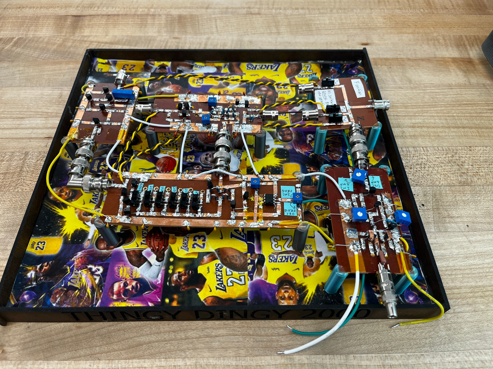
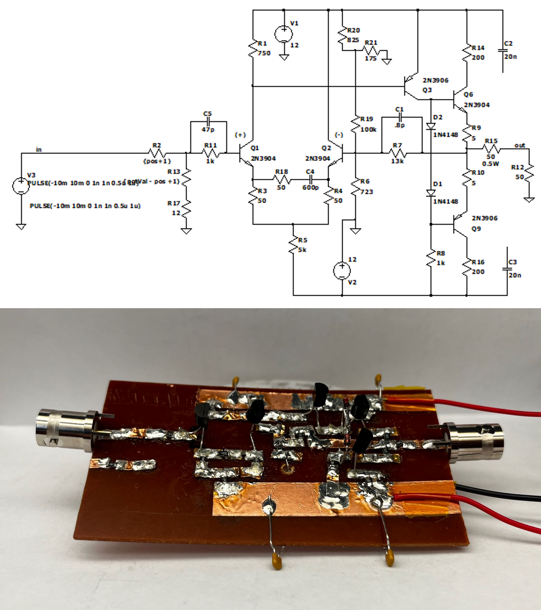
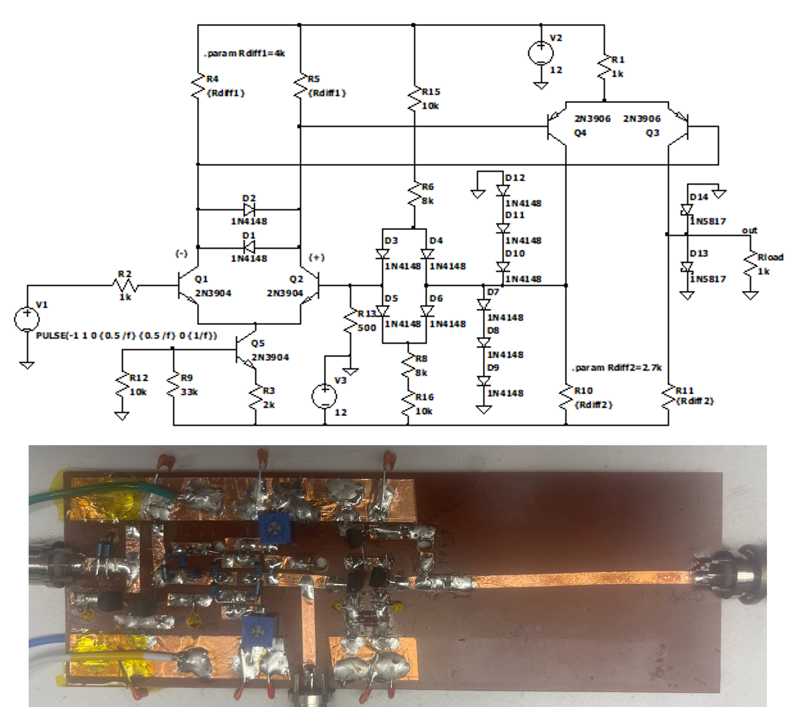
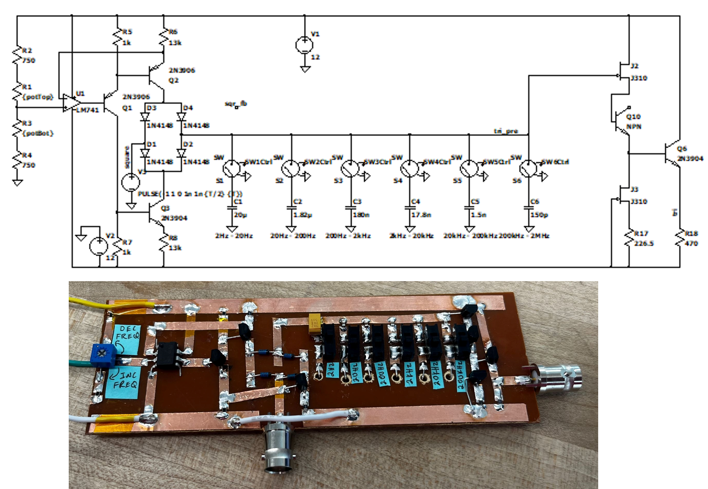
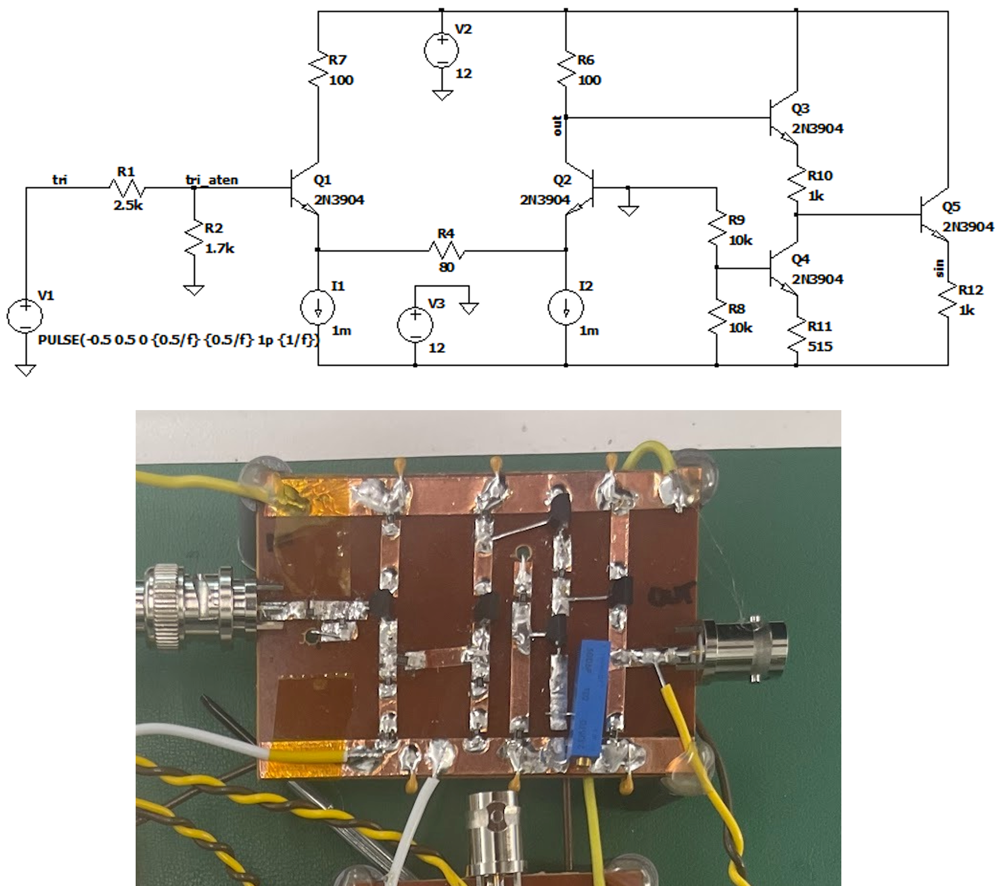

# The LeBronanator - 2Hz to 2MHz Function Generator

The LeBronanator is a function generator capable of generating sinusoidal, triangle, and square waves with variable amplitude from 2Hz to 2MHz. It was assembled using FR4 boards, copper tape, discrete BJTs (exclusively 2N3904s and 2N3906s), and passive devices like capacitors and inductors. The full function generator was built in parts as laboratory exercise and then the blocks were then integrated together. Each laboratory exercise started by completing a simulation of the descried circuit using LTSpice and then building the circuit. The first lab was to build an output amplifier stage for the function generator to gain up any signal fed into it. This gives the function generator's user the ability to vary the gain to their liking. The second lab was to build a Schmidt trigger. The Schmidt trigger has two purposes. One is to turn triangle waves into square waves, and this ultimately acts as the function generators square wave source. The second purpose is to help generate oscillations for the function generator to generate all its waveforms from. It is one part of the relaxation oscillator. The third lab was to build an integration. The integrator completes the relaxation oscillator. It accepts square waves from the Schmidt trigger and converts them into triangle waves. These triangle waves are then fed to the Schmidt trigger which turns them into square waves and the cycle repeats. The final lab was to build a Meyer-Sansen sine shaper. This circuit accepts triangle waves and smooths the top of the triangle wave to make a sinusoidal wave. Put all together this makes the function generator capable of generating sine, triangle, and square waves from 2Hz to 2MHz. To see the LeBronanator in action see this [link](https://youtu.be/n0qKOlhLN80) for a video demonstration and the photo below is the fully assembled LeBronanator.

## Output Amplifier

The front end of our function generator is an output amplifier. This block gives the user the ability to adjust output amplitude of the waveform (0 to 10) by adjusting a potentiometer. The 3dB bandwidth of the output amplifier is ~3MHz so we see little ringing from a square wave input. Below is an image of the schematic and the physical board built. See the lab report in the `lab1/` directory for a detailed discussion of the design of the output amplifier.

## Schmidt Trigger

The Schmidt trigger is part of the relaxation oscillator which is the heart of the function generator. This block turns triangle waves into square waves. It has adjustable triggers to help tune the square wave to have close to a 50% duty cycle. The triggers set where along the rising or falling edge of the triangle wave form the Schmidt trigger will swap its rail from high to low or low to high, thus making the square waveform. Below is an image of the schematic and the physical board built. See the lab report in the `lab2/` directory for a detailed discussion of the design of the Schmidt trigger.

## Integrator

The integrator is the second part of the relaxation oscillator. It turns the square wave output from the Schmidt trigger into triangle waves that are then fed back to the Schmidt trigger thus creating an oscillator. The integrator was designed to have 6 bands covering the frequency range of 2Hz to 2MHz. This was done by flipping individual switches that changes the capacitor connected to the current source. As the capacitor changed, the time it took for the capacitor to charge to the trigger thresholds in the Schmidt trigger therefore changes and thus the frequency either increases or decreases. Within a band the frequency is adjusted by varying the amount of current set to be sourced by the current source. Below is an image of the schematic and the physical board built. See the lab report in the `lab3/` directory for a detailed discussion of the design of the integrator.

## Sine Shaper

The sine shaper turns triangle waves into sinusoidal waves. This is done by using a Meyer-Sansen "shmusher" circuit. As the input triangle waves transition from low to high or high to low, the input differential pair transitions from its linear region to saturation where it rounds off, thus making a waveform that somewhat resembles a sinusoidal range. Our circuit ultimately had a THD of less than 2%. Below is an image of the schematic and the physical board built. See the lab report in the `lab4/` directory for a detailed discussion of the design of the sine shaper.
 

